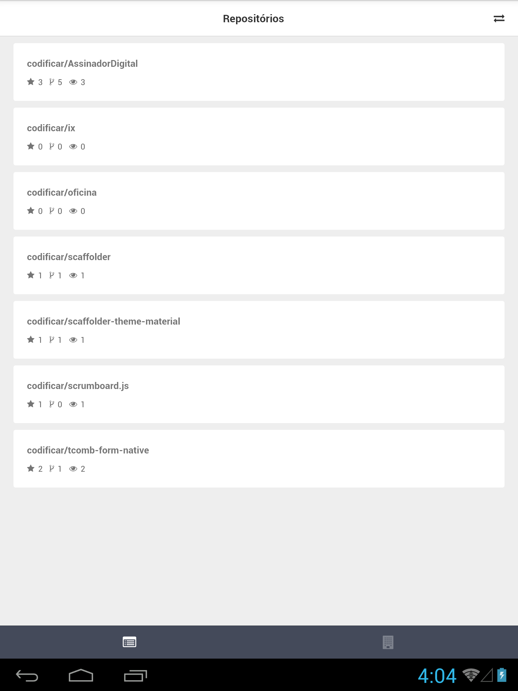

<h1>Buscador gitHub </h1>

O presente projeto simula um buscador de repositórios. Ele tem como objetivo listar os repositórios e organizações do usuário digitado. O fluxo do app é o seguinte : Na tela de Welcome, o usuário digita o username, uma requisição é feita para saber se o usuário realmente existe no github. Caso o usuário exista, o username digitado no <TextInput /> é salvo na memória do dispositivo. Caso não exista, uma mensagem de erro é apresentada. De posse do username, a tela de repositórios realiza a listagem de repositórios e organizações. Os repositórios exibem informações como números de estrelas e dentre outras informações.

<h2>Organização do código </h2>

O código react encontra-se dentro de src. Na raiz da pasta src, encontramos o arquivo componente App que envolve toda aplicação.

<ul>
  <li>components -> Armazena os componentes reutilizáveis da aplicação. Ex: Header.js </li>
  <li>services -> armazena dados de serviços externos , como por exemplo a URL_BASE da api.</li>
  <li>pages -> armazena as telas do app. Cada tela contém um arquivo index.js e um style.js</li>
  <li>styles -> armazena estilos globais da aplicação. Ex: cores, métricas e etc ... </li>
  <li>config -> armazena configuraçẽos de ferramentas, como por exemplo o Reactotron(Debug do código)</li>
</ul>

Instruções de instalação do projeto:
<ul>
  <li>Para simular o app, é necessário ter um ambiente de desenvolvimento react-native bem configurado. Segue o melhor tutorial para essa configuração https://docs.rocketseat.dev/ambiente-react-native/introducao </li>
  <li> Após ter configurado, execute um <b>yarn install</b> e após a instalação dos pacotes, execute <b> react-native run-android </b> na pasta do projeto e acesse o app no emulador. </li>
</ul>

